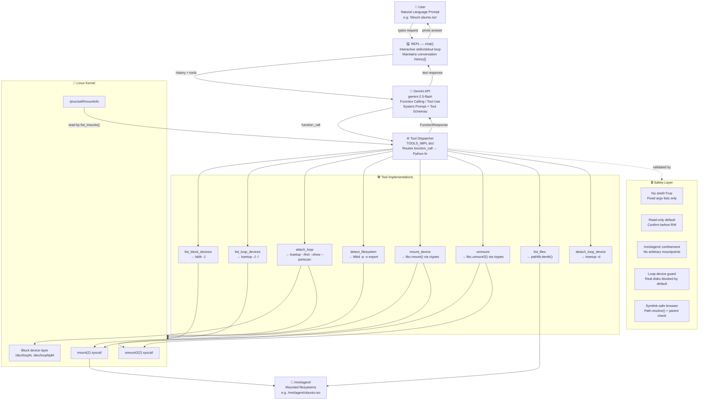
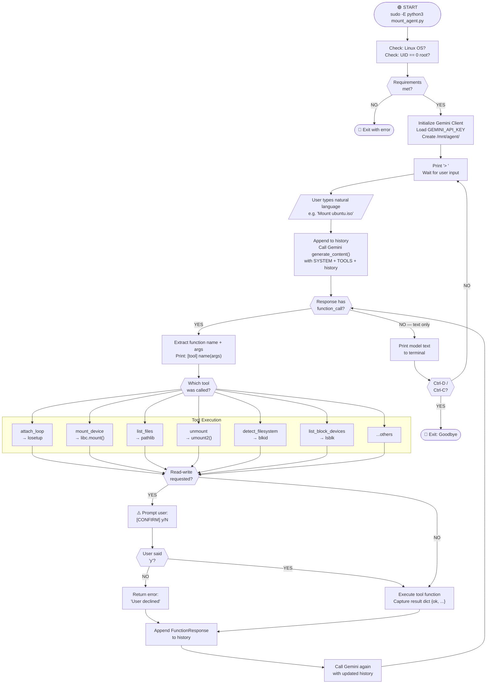

# Mount & Partition Agent — Diagrams

## 1. Architecture / Code Block Diagram

```mermaid
flowchart TD
    USER["🧑 User\nNatural Language Prompt\ne.g. 'Mount ubuntu.iso'"]
    REPL["💻 REPL — chat()\nInteractive stdin/stdout loop\nMaintains conversation history[]"]
    GEMINI["🤖 Gemini API\ngemini-2.5-flash\nFunction Calling / Tool Use\nSystem Prompt + Tool Schemas"]
    DISPATCH["⚙️ Tool Dispatcher\nTOOLS_IMPL dict\nRoutes function_call → Python fn"]

    subgraph TOOLS["🛠️ Tool Implementations"]
        T1["list_block_devices\n→ lsblk -J"]
        T2["list_loop_devices\n→ losetup -J -l"]
        T3["attach_loop\n→ losetup --find --show --partscan"]
        T4["detect_filesystem\n→ blkid -p -o export"]
        T5["mount_device\n→ libc.mount() via ctypes"]
        T6["unmount\n→ libc.umount2() via ctypes"]
        T7["list_files\n→ pathlib.iterdir()"]
        T8["detach_loop_device\n→ losetup -d"]
    end

    subgraph SAFETY["🔒 Safety Layer"]
        S1["No shell=True\nFixed argv lists only"]
        S2["Read-only default\nConfirm before RW"]
        S3["/mnt/agent/ confinement\nNo arbitrary mountpoints"]
        S4["Loop-device guard\nReal disks blocked by default"]
        S5["Symlink-safe browser\nPath.resolve() + parent check"]
    end

    subgraph KERNEL["🐧 Linux Kernel"]
        K1["mount(2) syscall"]
        K2["umount2(2) syscall"]
        K3["/proc/self/mountinfo"]
        K4["Block device layer\n/dev/loopN, /dev/loopNpM"]
    end

    MNT["📁 /mnt/agent/\nMounted filesystems\ne.g. /mnt/agent/ubuntu-iso"]

    USER -->|"types request"| REPL
    REPL -->|"history + tools"| GEMINI
    GEMINI -->|"text response"| REPL
    GEMINI -->|"function_call"| DISPATCH
    DISPATCH --> T1 & T2 & T3 & T4 & T5 & T6 & T7 & T8
    DISPATCH -.->|"validated by"| SAFETY
    T1 & T2 & T3 & T4 --> KERNEL
    T5 & T6 --> K1 & K2
    T7 --> MNT
    T3 --> K4
    K1 --> MNT
    K3 -->|"read by list_mounts()"| DISPATCH
    DISPATCH -->|"FunctionResponse"| GEMINI
    REPL -->|"prints answer"| USER
```

---

## 2. Execution Flowchart

```mermaid
flowchart TD
    START(["🟢 START\nsudo -E python3 mount_agent.py"])
    CHK["Check: Linux OS?\nCheck: UID == 0 root?"]
    DEC_REQ{{"Requirements\nmet?"}}
    ERR_EXIT(["🔴 Exit with error"])
    INIT["Initialize Gemini Client\nLoad GEMINI_API_KEY\nCreate /mnt/agent/"]
    PROMPT["Print '> '\nWait for user input"]
    INPUT[/"User types natural language\ne.g. 'Mount ubuntu.iso'"/]
    APPEND["Append to history\nCall Gemini generate_content()\nwith SYSTEM + TOOLS + history"]
    DEC_TOOL{{"Response has\nfunction_call?"}}
    PRINT_TEXT["Print model text\nto terminal"]
    EXTRACT["Extract function name + args\nPrint: [tool] name(args)"]
    DEC_WHICH{{"Which tool\nwas called?"}}

    subgraph TOOL_EXEC["Tool Execution"]
        EX1["attach_loop\n→ losetup"]
        EX2["mount_device\n→ libc.mount()"]
        EX3["list_files\n→ pathlib"]
        EX4["unmount\n→ umount2()"]
        EX5["detect_filesystem\n→ blkid"]
        EX6["list_block_devices\n→ lsblk"]
        EXN["...others"]
    end

    DEC_RW{{"Read-write\nrequested?"}}
    CONFIRM["⚠️ Prompt user:\n[CONFIRM] y/N"]
    DEC_CONFIRM{{"User said\n'y'?"}}
    DENY["Return error:\n'User declined'"]
    EXEC["Execute tool function\nCapture result dict {ok, ...}"]
    APPEND_RESP["Append FunctionResponse\nto history"]
    CALL_AGAIN["Call Gemini again\nwith updated history"]
    DEC_EXIT{{"Ctrl-D /\nCtrl-C?"}}
    CLEANUP(["🔴 Exit: Goodbye"])

    START --> CHK --> DEC_REQ
    DEC_REQ -->|"NO"| ERR_EXIT
    DEC_REQ -->|"YES"| INIT --> PROMPT --> INPUT
    INPUT --> APPEND --> DEC_TOOL
    DEC_TOOL -->|"NO — text only"| PRINT_TEXT --> DEC_EXIT
    DEC_TOOL -->|"YES"| EXTRACT --> DEC_WHICH
    DEC_WHICH --> EX1 & EX2 & EX3 & EX4 & EX5 & EX6 & EXN
    EX1 & EX2 & EX3 & EX4 & EX5 & EX6 & EXN --> DEC_RW
    DEC_RW -->|"YES"| CONFIRM --> DEC_CONFIRM
    DEC_CONFIRM -->|"NO"| DENY --> APPEND_RESP
    DEC_CONFIRM -->|"YES"| EXEC --> APPEND_RESP
    DEC_RW -->|"NO"| EXEC
    APPEND_RESP --> CALL_AGAIN --> DEC_TOOL
    DEC_EXIT -->|"YES"| CLEANUP
    DEC_EXIT -->|"NO"| PROMPT
```
